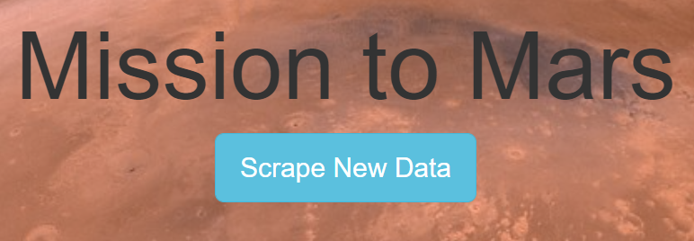
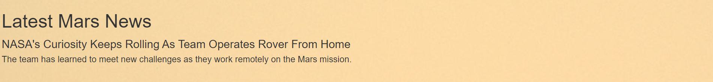
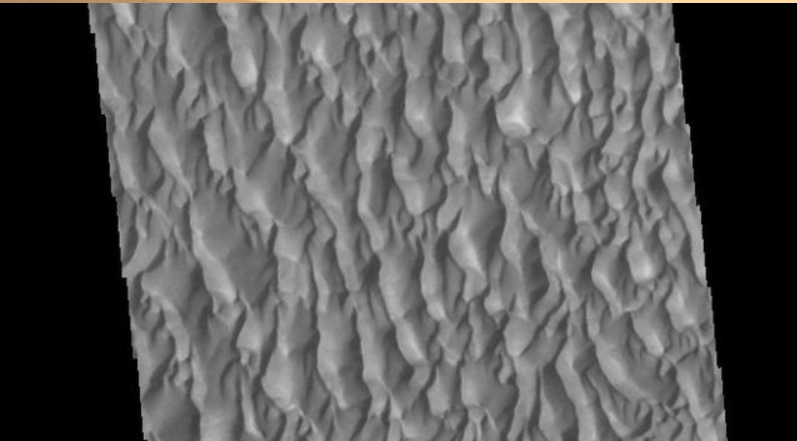
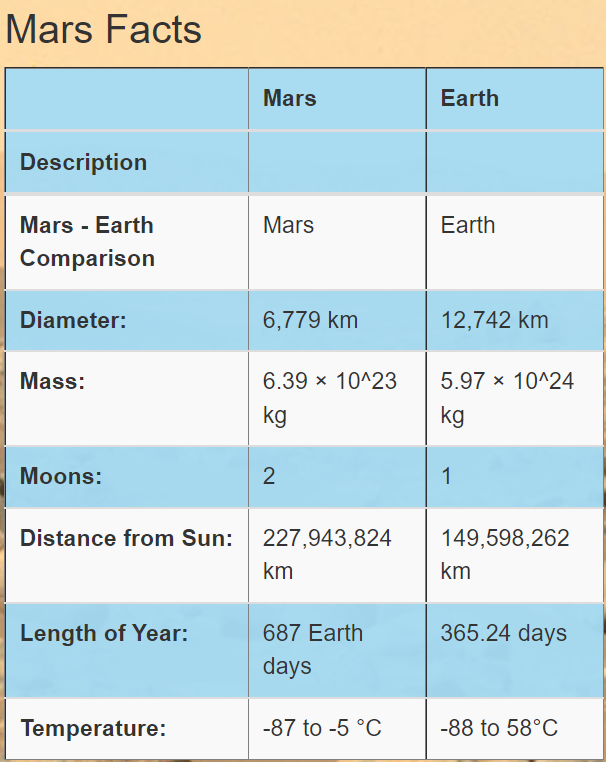
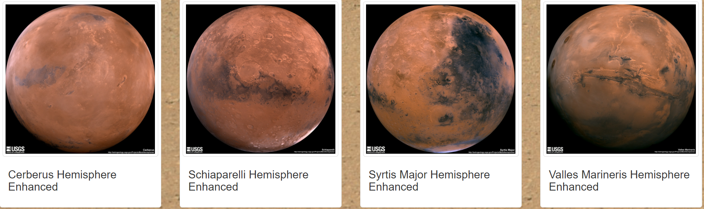

# Mission-to-Mars
## Project Overview
Mission-to-Mars project use Web Page Construction, BeautifulSoup,Splinter, MongoDB and Flask to build an app to scraping websites for Mars data. And through HTML page, we display our findings

## Results
- Customize click button to scrape new data from Mars:

- Mars News:

- Feature image from Mars:

- Mars Facts table:

- Scrape Full-Resolution Mars Hemisphere images and title:

## Summary
In Mission-to-Mars project, we automate and customize our web browsers, extract Mission to Mars data by visiting different websites. Also, we store data in a NoSQL database, and render our data in a web application create with Flask. We perfom our findings and display in the webpage.
